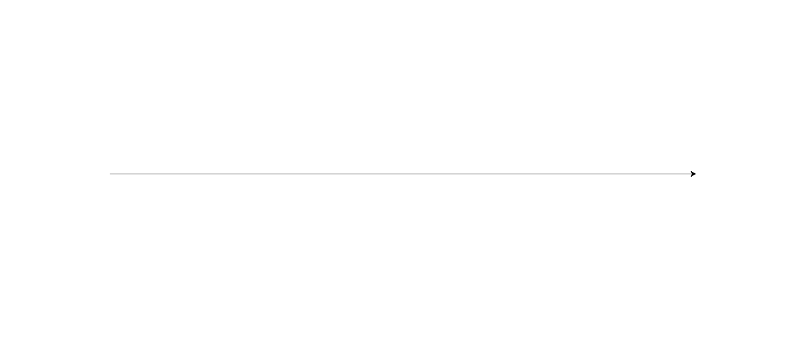
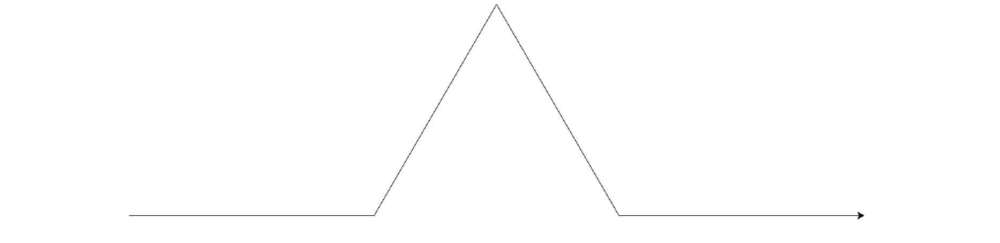
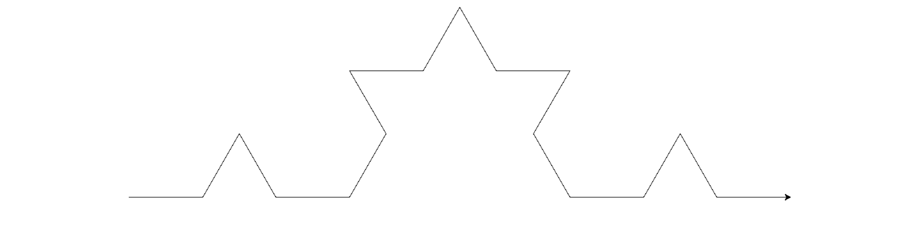
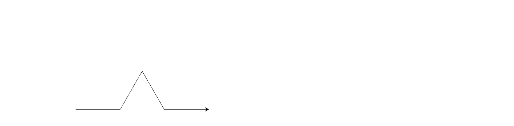
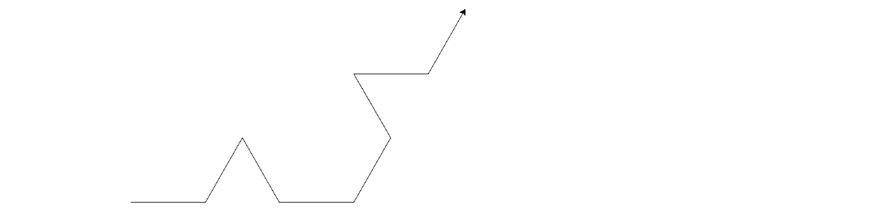
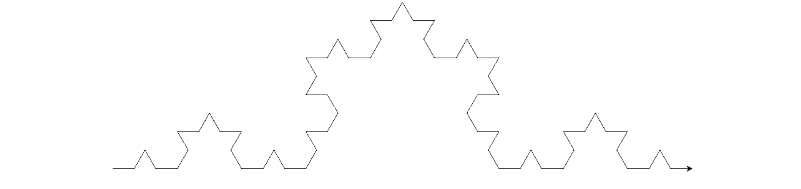

<link href='https://fonts.googleapis.com/css?family=Merriweather:400,700,400italic,700italic' rel='stylesheet' type='text/css'>

<style>
img {
	width: 80%;
}
</style>

# Drawing with Recursion, AlphabetRange, and Another Recursive Function


<pre><code data-trim contenteditable>                    _/\_
                   \    /
               _/\_/    \_/\_ 
              \              /
              /_            _\
                \          /
     _/\_      _/          \_     _/\_               
    \    /    \             /    \    /
_/\_/    \_/\_/             \_/\_/    \_/\_

</code></pre>
_ 

\* additional 4 points to lower scoring midterm 

## Overview

There are three parts to this assignment:

1. `drawing.py` - create a drawing by writing a recursive function
2. `alpharange.py` and `test_alpharange.py` - create a class that results in instances that are iterable, add a test to an existing set of tests
3. `recursive.py` and `test_recursive.py` - write a recurive function and test it


## Part 1: Drawing with Recursion

### 1. A Line

In `drawing.py`, create a function `draw`:

* that has at least one argument, a size
* calling the function creates a line in the direction that that the `turtle` is currently facing
* the length of the line is specified by the `size` argument

For example, calling `draw` may result in the drawing below:




### 2. A Line with a Triangular Bump

Comment out the function from the previous part. Copy it and modify the copy so that instead of drawing a straight line when calling `draw`...

* a line with a triangular bump is drawn
* the first 3rd of the line will be straight
* then, a _bump_ should be created, with each side being 1/3 of the length of the size argument
* the interior angles of the triangular bump should be 60, making an equilateral triangle (note that the bottom of the triangle is not drawn)
* finally, the remaining 3rd of the line should continue in the original direction that the line had started

For example, calling `draw` may result in the drawing below:




### 3. Triangular Bumps on a Triangular Bump

Now, we're going to try to replace each line segment from the previous drawing with smaller self-similar versions of the original:



Comment out the function from the previous part. Copy it and modify the copy so that:

* any instance of drawing a line (`forward`) is replaced by calling another function, `inner_draw`
* `inner_draw` will behave like the original `draw` function, drawing a line with a triangular bump
* `inner_draw` will be called from within the definition of `draw` (it can be called multiple times):
	```
def draw(...):
	.
	.
	.
	inner_draw(...)
	.
	.
    .
```
* the resulting drawing will look like every straight line were replaced with a proportionally smaller line with a triangular bump 

For example, replacing the first two line segments from the previous part will look like this: 





### 4. Bumps on Bumps on a Bump

Of course, we can make a third function, `inner_inner_draw` (that draws a line with a triangular bump; same as `inner_draw` previously), to replace every line segment from the previous part with (again) a line with a triangular bump. Comment out your previous two functions, copy their definitions, and modify them so that every call to `forward` in `inner_draw` is replaced by `inner_inner_draw` so that we get a drawing that looks like this:




### 5. Just one Function

Instead of using multiple functions (`draw`, `inner_draw`, and `inner_inner_draw`), write a single recursive `draw` function to create the same image. Comment out your code from the previous part and rewrite your `draw` function:

1. the function, `draw`,  should call itself
2. on each inner call -- recursive call --  to `draw`, the size argument should decrease
3. there could be more than one recursive call in the  body
4. there should be a case -- the base case -- where the function does not call itself (and instead draws without recursion)
5. what condition should this base case depend on? Perhaps use the length/size passed in to determine whether or not to make a recursive call

### 6. Just one Function with a Counter

Modify your previous code so that an extra argument, a counter, is included. Once this counter reaches zero, stop making recursive calls. When making recursive calls, pass in a counter argument that is one less than its previous value.

### 7. A Shape

Lastly, use your most recent `draw` function to create the shape below


## Part 2: AlphabetRange

### 1: Implement AlphabetRange Class

In `alpharange.py` create a class, `AlphabetRange` that works like range, but with uppercase letters.

Printing an instance of `AlphabetRange` results in the start letter and the end letter separated by a dash, followed by a comma and the value for the _step_ (the amount to increment by to get to the next letter).

Calling range with a single letter starts from `A` and goes up to the letter specified by going over ever letter from `A` to the letter specified (but not including it) one at a time:

```
letters = AlphabetRange('D')
print(letters)
for letter in letters:
    print(letter)
```

The resulting output from the code above is:

```
A-D, 1
A
B
C
```

Calling range with two arguments starts from the first letter and goes up to the second letter, _incrementing_ by one letter at a time :

```
letters = AlphabetRange('B', 'E')
print(letters)
for letter in letters:
    print(letter)
```

The resulting output from the code above is:

```
B-E, 1
B
C
D
```

Finally, calling range with three arguments starts from the first letter and goes up to the second letter by using a _step_ value to determine the _next_ letter. The example below increments by two letters (`C` is first, followed by `E`)

```
letters = AlphabetRange('C', 'L', 2)
print(letters)
for letter in letters:
    print(letter)
```

The output of the code above i:

```
C-L, 2
C
E
G
I
K
```

__Hints__

1. use `*args` as the argument to collect all of the arguments into a tuple named `args`
2. in the body of your function, use the length of `args` to determine what the start, stop, and step should be (keeping in mind the default values based on the examples above)
3. for iteration, don't forget to implement both `__iter__` and `__next__` so that instances of your class will work with for loops

### 2: Running and Writing Tests

Test your `AlphabetRange` class by running `test_alpharange.py`. This tests the different variations (1, 2, and argument versions) of creating instances of your class.

Note that it's missing a test for determining whether or not the string version of your class works.

__Add a test__ in `test_alpharange` that determines whether or not `__str__` has been implemented and is working correctly. Do this by:

1. creating an additional method within the class
2. using `self.assert*` (for example, `assertEqual`) to check expected and observed values from your test run

## Part 3: Another Recursive Function

### 1. Write a Recursive Function

In `recursive.py`, write a recursive function `count_nested_tuple` that counts the total number of all elements in a tuple. If there are tuples nested within the original tuple, count each element within the inner tuple as a separate and discrete element. For example, `(1, (2, 3), 4)` should result in a count of 4 (despite having a nested tuple containing two elements.

Here's how the function may work:

```
print(count_nested_tuple((1,)))
print(count_nested_tuple((1, 2)))
print(count_nested_tuple((1, (2, 3))))
print(count_nested_tuple((1, (2, 3), 4)))
print(count_nested_tuple((1, (2, 3, (4, 5)))))
print(count_nested_tuple((1, (2, 3, (4, 5), 6))))
```

Output from code above:

```
1
2
3
4
5
6
```

### 2. Test your Recursive Function

In `test_recursive.py` write a test class (don't forget to inherit from `unitteset.TestCase`) that runs at least two tests using your `recursive.py` module.
