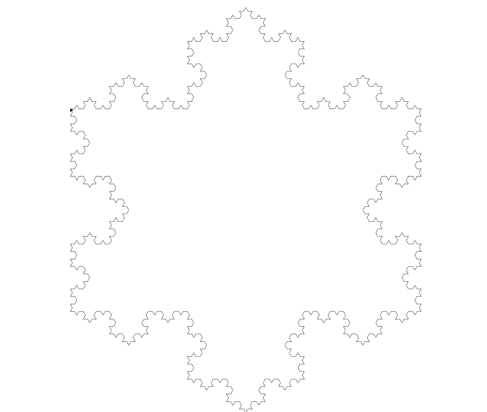

<link href='https://fonts.googleapis.com/css?family=Merriweather:400,700,400italic,700italic' rel='stylesheet' type='text/css'>

<style>
img {
	width: 80%;
}
</style>

# Drawing with Recursion, AlphabetRange, and More Recursive Functions


<pre><code data-trim contenteditable>                    _/\_
                   \    /
               _/\_/    \_/\_ 
              \              /
              /_            _\
                \          /
     _/\_      _/          \_     _/\_               
    \    /    \             /    \    /
_/\_/    \_/\_/             \_/\_/    \_/\_

</code></pre>
_ 

\* additional 4 points to lower scoring midterm 

## Overview

## Setup

## ⚠️ Submission / Scoring

## Part 1: Drawing with Recursion

### 1. A Line


```
def draw(t, size):
    t.forward(size/3)
```

### 2. A Line with a Triangular Bump


```
def draw(t, size):
    t.forward(size/3)
    t.left(60)
    t.forward(size/3)
    t.right(120)
    t.forward(size/3)
    t.left(60)
    t.forward(size/3)
```

### 3. Triangular Bumps on a Triangular Bump


```
def inner_draw(t, size):
    t.forward(size/3)
    t.left(60)
    t.forward(size/3)
    t.right(120)
    t.forward(size/3)
    t.left(60)
    t.forward(size/3)

def draw(t, size):
    inner_draw(t, size/3)
    t.left(60)
    inner_draw(t, size/3)
    t.right(120)
    inner_draw(t, size/3)
    t.left(60)
    inner_draw(t, size/3)
```

### 4. Bumps on Bumps on a Bump


```
def inner_inner_draw(t, size):
    t.forward(size/3)
    t.left(60)
    t.forward(size/3)
    t.right(120)
    t.forward(size/3)
    t.left(60)
    t.forward(size/3)

def inner_draw(t, size):
    inner_inner_draw(t, size/3)
    t.left(60)
    inner_inner_draw(t, size/3)
    t.right(120)
    inner_inner_draw(t, size/3)
    t.left(60)
    inner_inner_draw(t, size/3)

def draw(t, size):
    inner_draw(t, size/3)
    t.left(60)
    inner_draw(t, size/3)
    t.right(120)
    inner_draw(t, size/3)
    t.left(60)
    inner_draw(t, size/3)
```

### 5. Just one Function

```
def draw(t, size):
    if size < 100:
        t.forward(size)
    else:
        draw(t, size/3)
        t.left(60)
        draw(t, size/3)
        t.right(120)
        draw(t, size/3)
        t.left(60)
        draw(t, size/3)
```

### 6. Counter


```
def draw(t, counter, size):
    if counter == 0:
        t.forward(size)
    else:
        draw(t, counter - 1, size/3)
        t.left(60)
        draw(t, counter - 1, size/3)
        t.right(120)
        draw(t, counter - 1, size/3)
        t.left(60)
        draw(t, counter - 1, size/3)
```
## Part 2: AlphabetRange

### 1: Implement AlphabetRange Class
```
letters = AlphabetRange('D')
print(letters)
for letter in letters:
    print(letter)
```
```
A-D, 1
A
B
C
```

```
letters = AlphabetRange('B', 'E')
print(letters)
for letter in letters:
    print(letter)
```

```
B-E, 1
B
C
D
```

```
letters = AlphabetRange('C', 'L', 2)
print(letters)
for letter in letters:
    print(letter)
```

```
C-L, 2
C
E
G
I
K
```

### 2: Write a Test

## Part 3: Recursive Functions

```
print(count_nested_tuple((1,)))
print(count_nested_tuple((1, 2)))
print(count_nested_tuple((1, (2, 3))))
print(count_nested_tuple((1, (2, 3), 4)))
print(count_nested_tuple((1, (2, 3, (4, 5)))))
print(count_nested_tuple((1, (2, 3, (4, 5), 6))))
```
```
1
2
3
4
5
6
```
